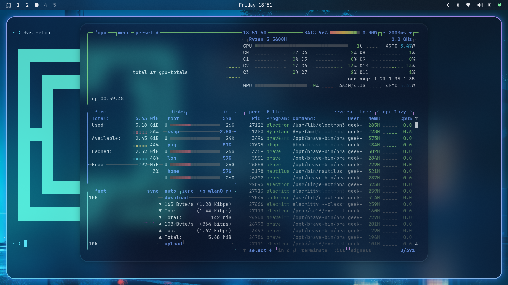
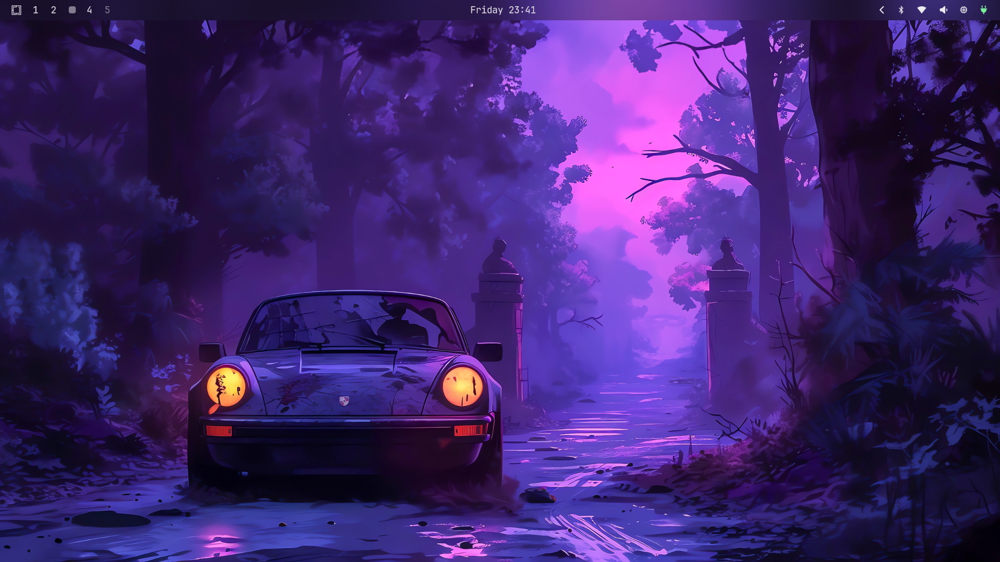
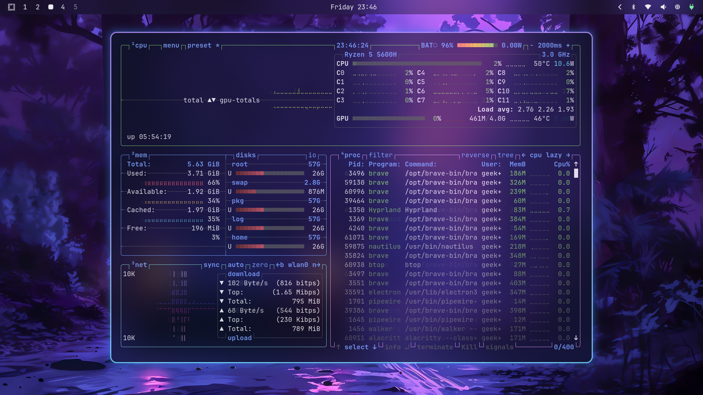
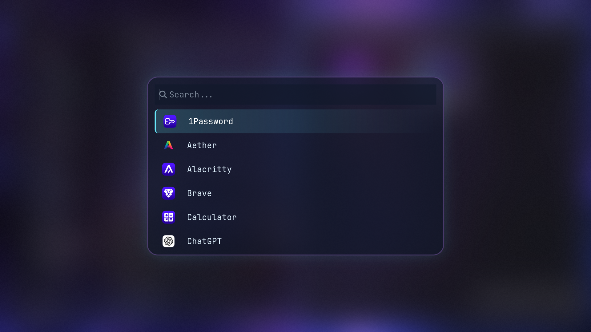

# 💧 Phanes Omarchy Liquid Theme

A stunning liquid-inspired Omarchy theme featuring glacial blues, aquamarine accents, and glass-morphism effects. Inspired by the pristine waters of Lake Tahoe, this theme brings a fluid, modern aesthetic to your Arch Linux + Hyprland desktop.



## 🌊 Overview

**Phanes** is a custom Omarchy theme that transforms your desktop into a serene, liquid-themed workspace. With heavy blur effects, gradient borders, and a carefully crafted color palette inspired by alpine waters, this theme offers a perfect balance between visual appeal and productivity.

### ✨ Key Features

- **Liquid Glassmorphism**: Heavy blur effects and transparent overlays create a distinctive glass-like appearance
- **Gradient Borders**: Dynamic aquamarine-to-purple gradients on active windows
- **Cohesive Color Palette**: Ice whites, deep sapphires, and vibrant cyans throughout all components
- **Smooth Animations**: Fluid bezier curves for a liquid-like motion feel
- **Complete Integration**: Themed components for Hyprland, Waybar, Alacritty, Kitty, Hyprlock, and more

## 🎨 Color Palette

| Color | Hex | Usage |
|-------|-----|-------|
| **Ice White** | `#e0f2fe` | Foreground text |
| **Deep Sapphire** | `#0f172a` | Background |
| **Aquamarine** | `#67e8f9` | Primary accent (cursor, borders) |
| **Electric Blue** | `#3b82f6` | Secondary accent |
| **Iridescent Purple** | `#c084fc` | Tertiary accent |
| **Soft Coral** | `#f472b6` | Error/warning states |
| **Neon Mint** | `#2dd4bf` | Success states |

## 📦 Installation

### Prerequisites

- [Omarchy](https://omarchy.org) must be installed

### Quick Install

Using the Omarchy theme installer:

```bash
omarchy-theme-install https://github.com/GeekyAbs/phanes-omarchy-theme
```

Or via the Omarchy menu:
1. Press `Super + Alt + Space` to open the Omarchy menu
2. Navigate to **Install → Theme**
3. Paste the repository URL
4. Apply the theme from **Style → Theme** menu


## 🖥️ Themed Components

This theme provides configurations for:

- **Hyprland** - Window manager with liquid animations and gradient borders
- **Waybar** - Status bar with droplet-inspired workspace indicators
- **Alacritty/Kitty** - Terminal emulators with matching color schemes
- **Neovim** - Custom colorscheme with syntax highlighting
- **Mako** - Notification daemon with aquamarine borders
- **Walker** - Application launcher with glassmorphic background
- **Hyprlock** - Lock screen with elegant time display
- **SwayOSD** - On-screen display for volume/brightness
- **BTTop** - System monitor with liquid-themed graphs
- **GTK** - System-wide GTK theme integration
- **Eza** - File listing with color-coded types

## 🎯 Design Philosophy

Tahoe Liquid embraces the "liquid geometry" aesthetic with:

1. **Transparency & Blur**: Heavy use of backdrop blur creates depth
2. **Flowing Animations**: Bezier curves named "fluid" and "drip" for natural motion
3. **Gradient Accents**: Multi-color gradients that shift smoothly
4. **Minimal Borders**: Thin, glowing borders that don't distract
5. **High Contrast**: Ice white text on deep sapphire for excellent readability

## 🔧 Customization

### Adjusting Transparency

Edit `hyprland.conf`:
```conf
decoration {
    active_opacity = 0.90    # Adjust between 0.70-1.00
    inactive_opacity = 0.80  # Adjust between 0.60-0.90
}
```

### Changing Blur Intensity

Edit `hyprland.conf`:
```conf
blur {
    size = 12        # Default: 12 (range: 4-20)
    passes = 3       # Default: 3 (range: 1-4)
}
```

### Terminal Opacity

**Alacritty** (`alacritty.toml`):
```toml
[window]
opacity = 0.70  # Adjust between 0.60-0.95
```

**Kitty** (`kitty.conf`):
```conf
background_opacity 0.75  # Adjust between 0.60-0.95
```

## 🙏 Credits

This theme is based on the original work by **[Abhijeet Swami](https://github.com/abhijeet-swami)**, who created the foundational Ayaka theme for Omarchy. **Phanes** is a fork and a personal evolution of that work, featuring:

- Redesigned color palette inspired by alpine waters
- Enhanced glassmorphism and blur effects
- New gradient borders and animations
- Expanded component coverage

Original inspiration: [omarchy-ayaka-theme](https://github.com/abhijeet-swami/omarchy-ayaka-theme)

Special thanks to:
- **[DHH](https://github.com/dhh)** for creating Omarchy
- **Abhijeet Swami** for the original Ayaka theme that served as the foundation
- The Hyprland and Omarchy communities

## 📸 Screenshots

### Desktop


### Terminal


### System Monitor

### Application Launcher


## 📝 License

This theme is released under the MIT License. Feel free to modify and distribute.

## 🔗 Links

- [Omarchy Official](https://omarchy.org)
- [Omarchy Manual](https://learn.omacom.io/2/the-omarchy-manual)
- [Original Ayaka Theme](https://github.com/abhijeet-swami/omarchy-ayaka-theme)
- [Hyprland](https://hyprland.org)

## 🐛 Issues & Contributing

Found a bug or want to contribute? Feel free to:
- Open an issue on GitHub
- Submit a pull request
- Share your customizations

---

**Made with 💙 for the Omarchy community**
